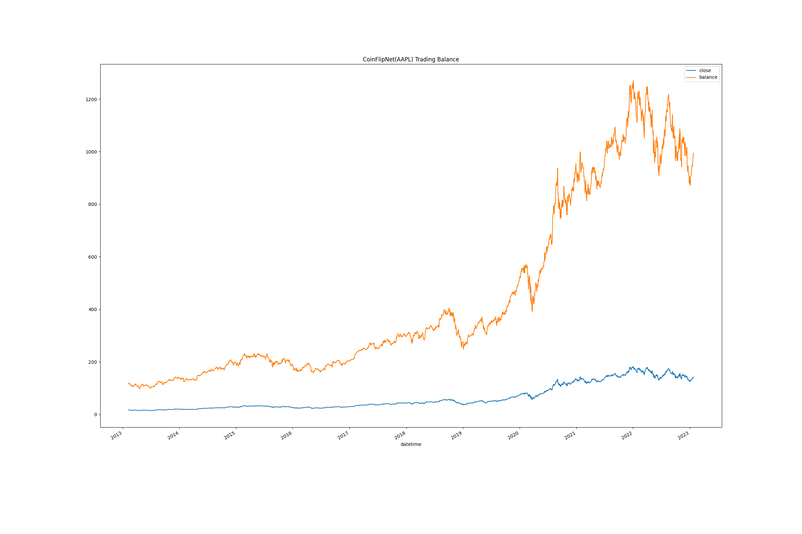
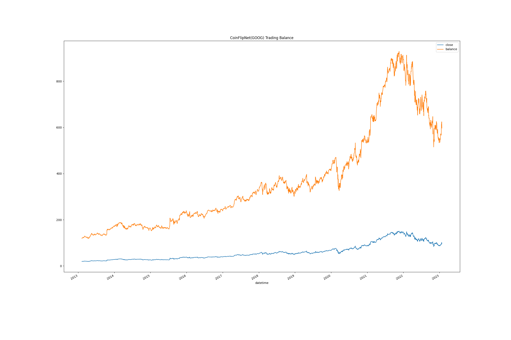
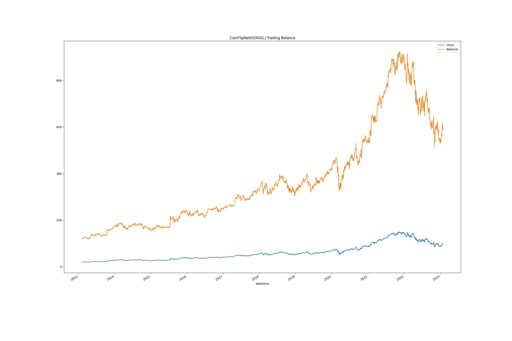
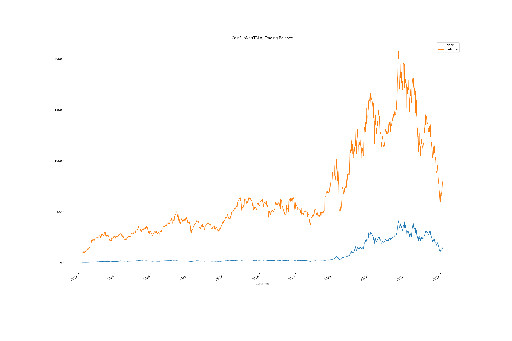
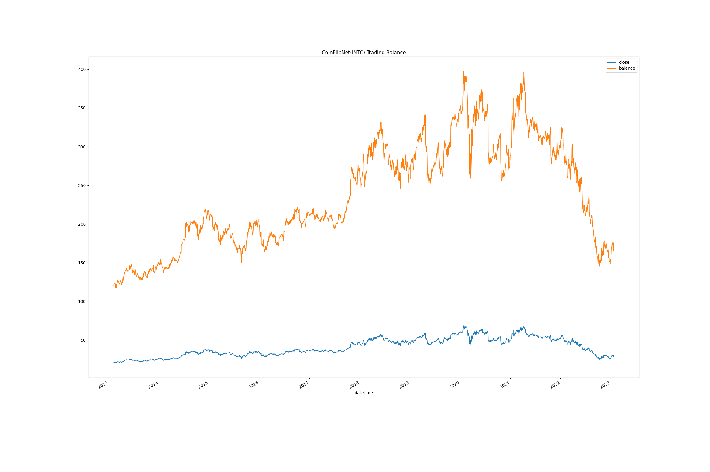
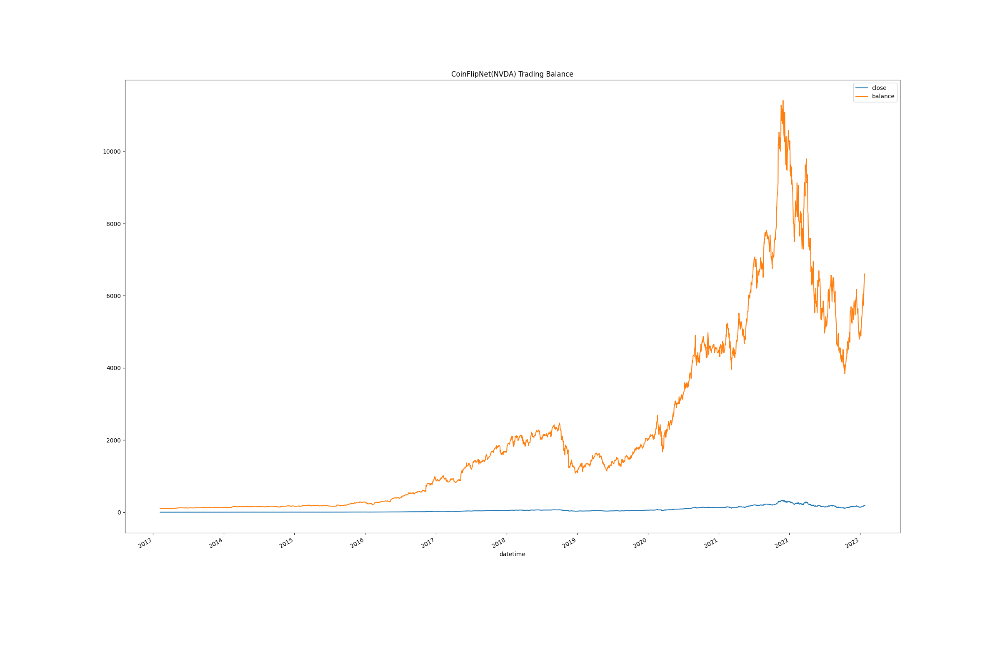
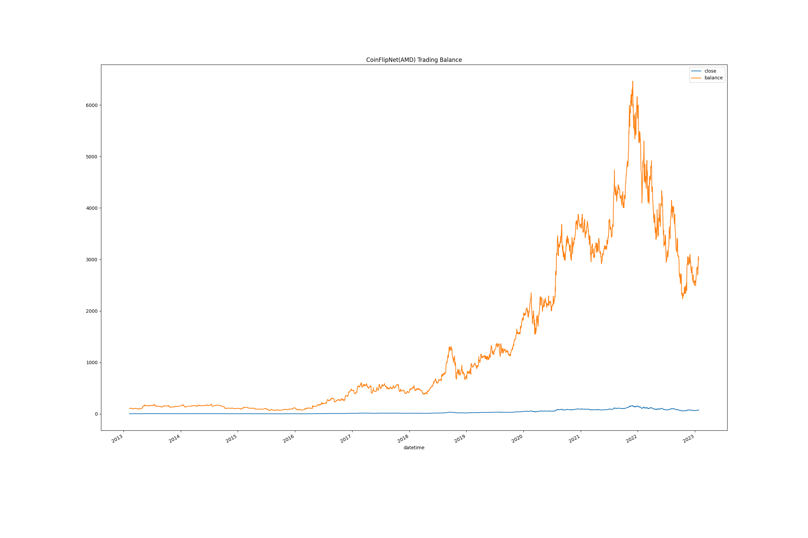
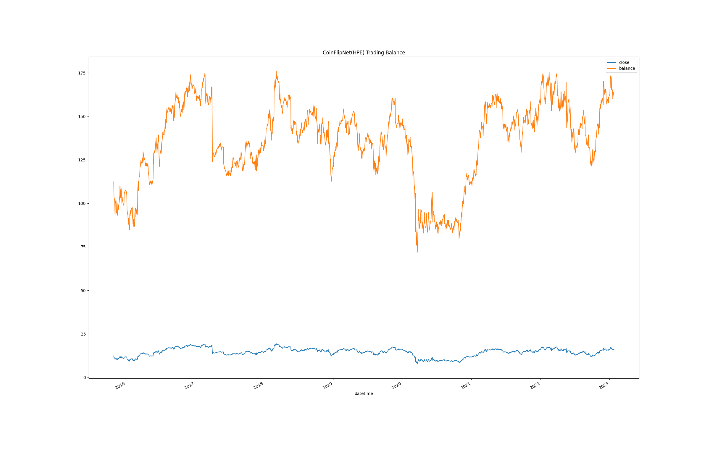

## FauxNet - Neural Networks for Big-Business-Boys
#### (**very much** a WIP)

---

### 'CoinFlipNet' - A binary, BUY/SELL signal generation network
#### Current status: experimental

  Insert description of the network, its parameters and the methodology behind it here. Lorem ipsom dolor sit amet, consectetur adipiscing
elit et justo ex eiusmod tempor incididunt ut labore et dolore mag nulore magna aliqua. Ut enim ad minim veniam and yup and stuff...

  Anyhow, here are some charts demonstrating the efficacy of this module as tested on the following symbols: `MSFT, GOOG, GOOGL, TSLA, AAPL, SONY, INTC, NVDA, AMD, HPE`

